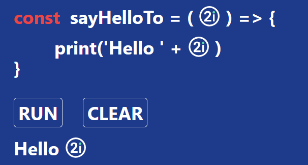
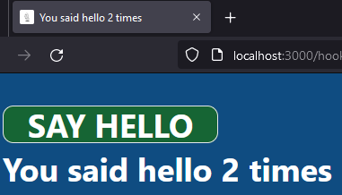

# What is React?
* "A JavaScript library for building user interfaces" – reactjs.org
* It was created by Facebook
* Used to generate Web Pages using JavaScript, JSX (HTML like code) and Virtual DOM
* It's smallish library that can be part of bigger framework (CRT, Next.JS and others)

### Sample React code:
```tsx
import Image from "next/image";
import { useMemo, useState } from "react";
  
const Hello = () => {
  const [quantity, setQuantity] = useState(0);
  const welcomes = useMemo(() => {
    return Array.from(Array(quantity)).map((_, i) => {
      return <Hello2i key={i} />;
    });
  }, [quantity]);
  
  return (
    <>
      <p className="flex">
        <span className="mr-5 text-red-500">const</span>sayHelloTo = (
        <Logo />) {" => {"}
      </p>
      <p className="mt-5 ml-20 flex">
        {"print('Hello ' + "}
        <Logo />
        {")"}
      </p>
      <p>{"}"}</p>
      <div className="mt-10 flex">
        <button
          className="mr-10 rounded-md border p-2"
          onClick={() => setQuantity((prev) => prev + 1)}
        >
          RUN
        </button>
        <button
          className="mr-10 rounded-md border p-2"
          onClick={() => setQuantity(0)}
        >
          CLEAR
        </button>
      </div>
      {welcomes}
    </>
  );
};
  
export default Hello;
  
const Logo = () => (
  <Image
    className="ml-3 mr-3 flex"
    src="/icon-logo.svg"
    alt="2iLogo"
    width={40}
    height={40}
  />
);
  
const Hello2i = () => (
  <p className="mt-5 flex">
    Hello <Logo />
  </p>
);
```

### Results in web page showing:


With RUN button which on every click adds new Hello 2i text and clear button which clears all Hello 2i messages. 

# Why use it?
* You can use same language for front end and back end dev (JavaScript/TypeScript)
* It is widely adopted and has great community and documentation
* It is supported by many libraries that make coding easy

# How to start with React
### Pre requirements
* Node.js (preferably LTS)
	* On Windows 10 and newer: `winget install OpenJS.NodeJS.LTS`
	* On most Linux distributions you can use [nvm](https://github.com/nvm-sh/nvm) and install node with `nvm install --lts`
* Up to date package manager
	*  `npm` (node package manager): 
		* `npm i -g npm`
	* `pnpm`
		* 'Fast, disk space efficient package manager' - pnpm.io
		* Install dependencies in single directory and the link them to save space 
		* https://pnpm.io/installation

### Some recommended ways to start with React
There are few ways to start making React app. Before we mention them is good to know some useful abbreviations/technologies.
* SSR - Server Side Rendering. App is also rendered on server, giving faster first loading time, much easier SEO (as the search engine robots can see whole html instead of dummy page) and much better performance on weaker devices. It's default on some of the libraries/frameworks.
* bundler - program used to build ready to deploy package. It collects all of your code and creates bundle(s) ready to deploy.
* SSG - Static Site Generation - code is compiled to html. It's extremely fast method but
* Frontend - focus on what's shown to end user in the browser
* Backend - focus on server side code - api, responding to html requests, etc.
* Full stack - Frontend and Backend together. Whole app including server and html rendering site.

* ### Vite
	* It's a builder that lets you create an app using popular frameworks/libraries
	* `npm create vite@latest`
	* Creates front end app
	* Fast (much times faster than popular in past `create-react-app`)
	* It includes only basic libraries / easy to maintain
	* It's easy to configure and adopt for production 
	* No built-in SSR
	* [More on Vite](https://vitejs.dev/guide/why.html)
* ### Next.js
	* `npx create-next-app@latest`
	* Full stack node framework with api, easy routing and other features. You don't need to use express and 
	* Fast
	* Includes helpful libraries
	* Helps enforce good programming practices, especially when used with TypeScript
	* By default using Server Side Rendering (but can work like traditional react app)
	* It enforces safe web programming practices, together with TypeScript it's hard to create bad next app
	* [More on Next.js](https://nextjs.org/)

* ### t3-app
	* `npm create t3-app@latest`
	* it will let you create full stack app with `Next.js`, `tRPC`, `tailwind css`, `typescript` and `NextAuth.js`
	* It's good to start your learning with - template has safe authentication, SSR, good style manager built in and follows established trends (it's not cutting edge React technology but close, stable enough to use in commercial projects)
* ### Astro
	* `npm create astro@latest`
	* It's SSG builder/framework. It's great for simple pages (portfolio, blogs, other static pages)
	* Most of the app is packaged directly to html, great solution where performance is important
	* It can be limiting for someone who wants to build single page app. 
* ### Remix
	* `npx create-remix@latest`
	* Full stack framework with many features built in
	* Built in solutions for most problems, from database connection to deployment
	* Enforces good coding techniques
	* Has built in templates that will allow you to deploy to traditional server with node and PostgreSQL, Node with SQLite or cloud serverless function with DynamoDB.
	* If it doesn't support technology you use it might be hard to adapt

* ### create-react-app
	* It's slow, heavy and creates harder to maintain packages (depends on a lot of libraries which are hard to keep up to date if you want to change their config for deployment)

## On TypeScript
* JavaScript with types
* More coding less debugging
	* According to Airbnb using typescript helped prevent 38% of the bugs
	* It would've helped with some bugs we had in 2i Apps
* Easy to learn if you used JavaScript or any typed language
* Thanks to tooling it's compiled to vanilla JavaScript, you get type safety in code and 100% combability when deployed
* By default supported as an option by Vite and Next.js
* ECMA (organisation that standardises JavaScript) is looking to implement TypeScript syntax into one of the coming ECMAScript releases. That means that TypeScript could be natively supported by browsers in the future
* It became most commonly used React language in 2022 for a reason :)

# JSX
It's a tag syntax, similar to HTML but converted to JavaScript by compiler.
You can create elements:
```tsx
const HelloElement: NextPage<{ who: string }> = (props) => (
  <p>Hello, {props.who}!</p>
);
```
And use them like:
`<HelloElement key={i} who="2i" />`
Resulting in web page showing:
`Hello, 2i!`

### There are some basic jsx elements built in to React, like
`<button>PRESS ME</button>`
`<div>SOME CONTENT</div>`
`<a href="https://www.reactjs.org"> link </a>`
There is also React.Fragment 
`<React.Fragment>SOME CODE</React.Fragment>` or simply `<>SOME CODE</>`
You can use it to return multiple elements
``` tsx
return (
      <React.Fragment>
		<td>Hello</td>
        <td>World</td>
      </React.Fragment> 
);
```

### JSX Properties
You can pass properties to JSX elements, some of more common ones are:
`className` - takes a string which is converted to html class tag. `<div className='red'>RED</div>` will result in page showing `<div class='red'>RED</div>`. Word `class` is recserved in JavaScript, that's why it's important not to mistake `className` with `class`.
`id` - same as HTML id. Example: `<button id='save-customer-button'>SAVE CUSTOMER</button>`
`key` - used to differentiate between iterable components. 
```tsx
const table = [
    <li key="A">First item</li>,
    <li key="B">Second item</li>,
    <li key="C">Third item</li>,
]
```

[More on JSX](https://reactjs.org/docs/jsx-in-depth.html#gatsby-focus-wrapper)

# Hooks
Hooks are functions which allow you to interact with Reacts state and rendering features without using classes and inheritance.
React hooks start with `use`.

## Importing hooks
You can import built in hooks with React, for example:
`import React, { useState, useEffect, useMemo } from 'react';`
Or use them directly from React object: `React.useState(0)`

## useState
useState takes `object` or `function` and returns an `array` with two elements, current state and `function` with which you can update the state. 
### Initialize with object
```tsx
const quantity = useState(1337);
console.log(quantity[0]) // 1337
```
or more commonly used:
```tsx
const [quantity, setQuantity] = useState(1337);
console.log(quantity); // 1337
```

State setter triggers re-render and new state value is used at the new render.
```tsx
const [quantity, setQuantity] = useState(1337);
setQuantity(1338)
console.log(quantity);
```
Will print out `1337` first, then `1338` and run in loop as setCount will trigger re-render every time element is rendered.

We can prevent loop from happening by triggering setter on customer action:
```tsx
import React, { useState } from "react";

const SayHello = () => {
  const [quantity, setQuantity] = useState(0);
  return (
    <>
      <button onClick={() => setQuantity(quantity + 1)}>SAY HELLO</button> // BUTTON
      {Array.from(Array(quantity)).map((_, i) => (
        <p key={i}>Hello!</p> // creates Hello! elements array equal in size to 
      ))}
    </>
  );
};

export default SayHello;

```
In the case above quantity is changed only when user clicks on SAY HELLO button. 

### Closures in React
The problem starts when there might be multiple changes caused by one event, like:
```tsx
import React, { useState } from "react";

const SayHello = () => {
  const [quantity, setQuantity] = useState(0);
  const clickHandler = () => {
    setQuantity(quantity + 1);
    setQuantity(quantity + 1);
  };
  return (
    <>
      <button onClick={clickHandler}>SAY HELLO</button>

      {Array.from(Array(quantity)).map((_, i) => (
        <p key={i}>Hello!</p>
      ))}
    </>
  );
};

export default SayHello;

```
It looks like on every click quantity should go up by 2.  But when we test it only goes up by 1. This is common mistake caused by the way JavaScript and React work. `clickHandler` is a [closure](https://developer.mozilla.org/en-US/docs/Web/JavaScript/Closures) where `quantity` is set to given value at render. If quantity equals `0` then running
```tsx
setQuantity(quantity + 1);
setQuantity(quantity + 1);
```
is the same as running
```tsx
setQuantity(0 + 1);
setQuantity(0 + 1);
```
Where both lines set quantity to `1`. We can solve this by using a function as a property for `setQuantity`:
```tsx
function increment(it: number) {
	return it + 1;
}
const clickHandler = () => {
	setQuantity(increment);
	setQuantity(increment);
}
```

Or whole element using [Arrow Function](https://developer.mozilla.org/en-US/docs/Web/JavaScript/Reference/Functions/Arrow_functions)
```tsx
import React, { useState } from "react";

const SayHello = () => {
  const [quantity, setQuantity] = useState(0);
  const clickHandler = () => {
    setQuantity((it) => it + 1);
    setQuantity((it) => it + 1);
  };
  return (
    <>
      <button onClick={clickHandler}>SAY HELLO</button>
      {Array.from(Array(quantity)).map((_, i) => (
        <p key={i}>Hello!</p>
      ))}
    </>
  );
};

export default SayHello;

```

### Initialize with function


## useEffect
useEffect allows you to perform side effect actions in your code. Side effects are actions that affect something outside of the function they're executed from. Some of the common side effects are: fetching data, setting state. changing DOM elements.

This hook takes in callback function and dependency array.

### useEffect without dependencies
```tsx
import React, { useEffect, useState } from "react";

const EffectHook = () => {
  const [quantity, setQuantity] = useState(0);

  useEffect(() => {
    document.title = `You said hello ${quantity} times`;
  });

  const clickHandler = () => {
    setQuantity((it) => it + 1);
  };
  return (
    <>
      <button
        onClick={clickHandler}
        className="m-1 w-60 rounded-xl border bg-green-800 hover:bg-green-700"
      >
        SAY HELLO
      </button>
      <p className="m-1">You said hello {quantity} times</p>
    </>
  );
};

export default EffectHook;
```
This effect will run on **every render**. At first component will be rendered with quantity `0` and `document.title` will be set using that value. Then, after every click, `clickHandler` will set the quantity, component will be rendered again and title changed to new value.


The title is set with useEffect hook, page content under the button is rendered with component.

### useEffect loops without dependencies
**Be careful with side effects that can cause new render. This can end up in infinite loop and bad app performance.**
```tsx
import React, { useEffect, useState } from "react";

const EffectHook = () => {
  const [quantity, setQuantity] = useState(0);
  const [titleHistory, setTitleHistory] = useState<string[]>([]);

  useEffect(() => {
    document.title = `You said hello ${quantity} times`;
    setTitleHistory((prev) => [...prev, document.title]);
  });

  const clickHandler = () => {
    setQuantity((it) => it + 1);
  };
  return (
    <>
      <button
        onClick={clickHandler}
        className="m-1 w-60 rounded-xl border bg-green-800 hover:bg-green-700"
      >
        SAY HELLO
      </button>
      <p className="m-1">You said hello {quantity} times</p>
    </>
  );
};

export default EffectHook;

```
![[Pasted image 20221124101630.png]]

### useEffect with dependencies
useEffect can also take an array of dependencies. It will check if any of the elements changed since last render and if they did, run the callback function.
```tsx
  useEffect(() => {
    document.title = `You said hello ${quantity} times`;
  }, [qunatity]);
```

### useEffect loops with dependencies
There are few things you have to watch for when using `useEffect` hook with dependencies.
Most common problem is changing the element that is one of the dependencies.
```tsx
  useEffect(() => {
    document.title = `You said hello ${quantity} times`;
    setQuantity((it) => it + 1);
  }, [quantity]);
```

Another common reason is using default values in as element props. Example below will end up in infinite loop.
```tsx
import React, { useEffect, useState } from "react";

const EffectHook = ({ names = [] }) => {
  const [namesSet, setNamesSet] = useState<Set<string>>(new Set());

  useEffect(() => {
    setNamesSet(new Set(names));
  }, [names]);
  
  return (
    <>
      <p>Hi.</p>
    </>
  );
};

export default EffectHook;

```
Because in JS `[] === []` is false, if default value is used then on every render hook will run. It's the same for all other objects apart from [Primitive types](https://developer.mozilla.org/en-US/docs/Glossary/Primitive).

### useEffect with empty dependency array
You can send empty array to make useEffect run once, only on first render of each component. This will set title to `You said hello 0 times` and it will not change with button presses.
```tsx
  useEffect(() => {
    reportPageVisitedByUser(pageName)
  }, []);
```
This is useful for actions that need to be done once for on component mount like event listeners, data fetching, data logging etc.

### useEffect with clean-up
Side effects shouldn't make changes on pages that have been unmounted. Also, event listeners created for element should be removed when this element is not rendered any mode. `useEffect` hook callback can return a function that will be run when element is dismounted.
```tsx
  useEffect(() => {
    let mounted = true; // This is a flag to prevent memory leaks
    setTimeout(() => {
      if (mounted) { 
        setQuantity(1000); // This will only be called if the component is still mounted
      }
    }, 10000);

    return () => {
      mounted = false; // This will be called when the component is unmounted
    };
  }, []);
```

Not using clean-up can cause hard to reproduce and diagnose problems that occur in testing and production. This is common with unexperienced users fetching data:
```tsx
  const fetchData = () => {
    return new Promise<string>((resolve) => {
      setTimeout(() => {
        resolve("John");
      }, 3000);
    });
  };

  useEffect(() => {
    fetchData().then((response) => {
        setName(response); // this could be called after user changed page
        // causing memory leak
      }
    });
  }, []);
```

One of the simplest solutions:
```tsx
  const fetchData = () => {
    return new Promise<string>((resolve) => {
      setTimeout(() => {
        resolve("John");
      }, 3000);
    });
  };

  useEffect(() => {
    let mounted = true; // This is a flag to prevent memory leaks
    fetchData().then((response) => {
      if (mounted) { // Check if component is still mounted
        setName(response);
      }
    });
    return () => {
      mounted = false; // This will be called when the component is unmounted
    };
  }, []);
```

## useMemo
`useMemo` lets you memoize values of calculations. It takes function and an array of dependencies, returns the value of the calculation on first render and on every change of one of the values.
```tsx
import React, { useMemo, useState } from "react";

const MemoHook = () => {
  const [quantity, setQuantity] = useState(0);
  const [name, setName] = useState("");

  const clickHandler = () => {
    setQuantity((it) => it + 1);
  };

  const expensiveFunction = (quantity: number) => {
    let i = 0;
    while (i < 1500000000) i++;
    return quantity;
  };

  // Value will be assigned directly to howManyTimes
  // without calling useState and rerendering the component
  const howManyTimes = useMemo(() => {
    return expensiveFunction(quantity); // This will be called only when quantity changes
  }, [quantity]);

  // Calculations below are cheap
  // so they can be called every time the component is rendered.
  const helloText =
    `You said hello ${howManyTimes} times` + (name ? `, ${name}` : "");

  return (
    <>
      <div className="flex">
        <p className="m-1">Type your name:</p>
        <input
          className="m-1 w-80 rounded-xl border bg-gray-200 px-2 text-gray-700"
          value={name}
          onChange={(e) => setName(e.target.value)}
        />
        <button
          onClick={clickHandler}
          className="m-1 w-60 rounded-xl border bg-green-800 hover:bg-green-700"
        >
          SAY HELLO
        </button>
      </div>
      <p className="m-1">{helloText}</p>
    </>
  );
};

export default MemoHook;
```

### useMemo vs useEffect & useState
Function above can be written using only useEffect and useState hooks, but this comes at a cost.
```tsx
import React, { useEffect, useState } from "react";

const NoMemo = () => {
  const [quantity, setQuantity] = useState(0);
  const [number, setNumber] = useState(0);
  const [name, setName] = useState("");
  const [helloText, setHelloText] = useState("");

  const clickHandler = () => {
    setQuantity((it) => it + 1);
  };
  
  const expensiveFunction = (quantity: number) => {
    let i = 0;
    while (i < 1500000000) i++;
    return quantity;
  };

  useEffect(() => {
    // This will run when quantity is changed, causing rerender
    setNumber(expensiveFunction(quantity));
  }, [quantity]);

  useEffect(() => {
    // This will run when number or name are changed, causing rerender
    setHelloText(`You said hello ${number} times` + (name ? `, ${name}` : ""));
  }, [number, name]);

  return (
    <>
      <div className="flex">
        <p className="m-1">Type your name:</p>
        <input
          className="m-1 w-80 rounded-xl border bg-gray-200 px-2 text-gray-700"
          value={name}
          onChange={(e) => setName(e.target.value)}
        />
        <button
          onClick={clickHandler}
          className="m-1 w-60 rounded-xl border bg-green-800 hover:bg-green-700"
        >
          SAY HELLO
        </button>
      </div>

      <p className="m-1">{helloText}</p>
    </>
  );
};

export default NoMemo;
```
We need to render whole component again and if we have large, complex components it can affect performance and responsiveness of the app. You should avoid using effects whenever possible, and if you have to use them, try the ones that won't cause re-render. 
For simple functions use direct assignments like:
```tsx
const helloText = `You said hello ${howManyTimes} times` + (name ? `, ${name}` : "");
```
instead of:
```tsx
  useEffect(() => {
    // This will run when number or name are changed, causing rerender
    setHelloText(`You said hello ${number} times` + (name ? `, ${name}` : ""));
  }, [number, name]);
```
For more complex ones try using `useMemo`:
```tsx
  const howManyTimes = useMemo(() => {
    return expensiveFunction(quantity); // This will be called only when quantity changes
  }, [quantity]);
```
To the function is only run when needed, doesn't change the state and will not cause re-render.